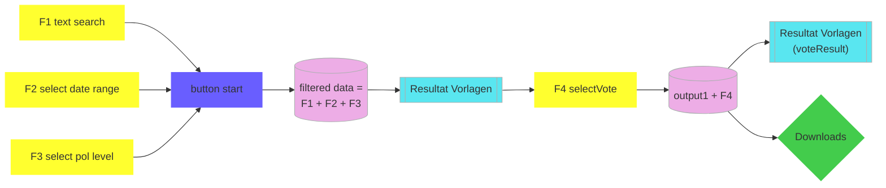

# ABDA
Shiny app for ABDA tool (Abstimmungsdatenbank).

The ABDA application on the website of Statistik Stadt Zürich shows the results of all popular votes since 1933 on communal, cantonal and federal level.

The data is obtained from the Open Data portal of the city of Zurich and is available [here](https://data.stadt-zuerich.ch/dataset/politik_abstimmungen_seit1933).

# Architecture

