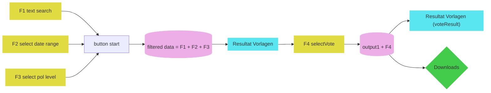

# ABDA
Shiny app for ABDA Tool (Abstimmungsdatenbank)

# Architektur

```mermaid
flowchart LR;
  f1[F1 text search]:::filter --> button[button start]
  f2[F2 select date range]:::filter --> button
  f3[F3 select pol level]:::filter --> button
  button --> output1[(filtered data = F1 + F2 + F3)]:::data
  output1 --> results1[[Resultat Vorlagen]]:::result
  results1 --> f4[F4 selectVote]:::filter
  f4 --> output2[(output1 + F4)]:::data
  output2 --> results2[["Resultat Vorlagen (voteResult)"]]:::result
  output2 --> downloads{Downloads}:::download
  
  classDef filter fill:#e0db41,stroke:#e0db41;
  classDef data fill:#edade6,stroke:#edade6;
  classDef result fill:#59e6f0,stroke:#59e6f0;
  classDef download fill:#43cc4c,stroke:#43cc4c;
```
